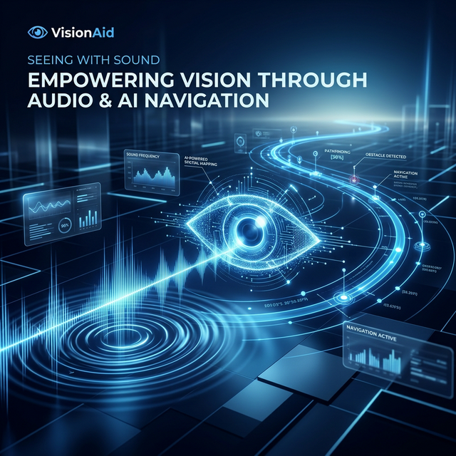
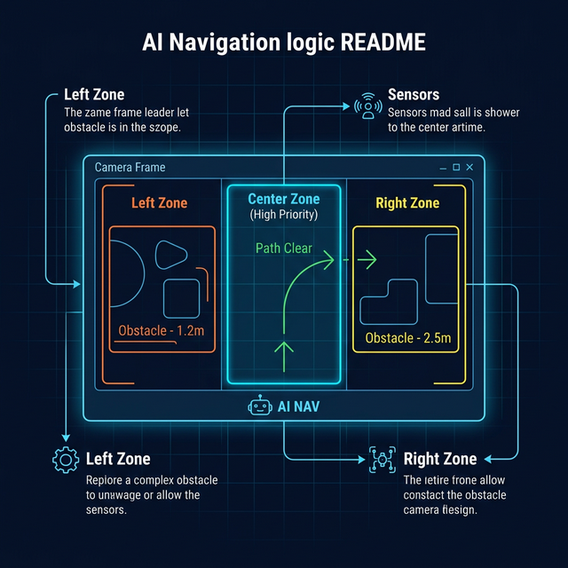
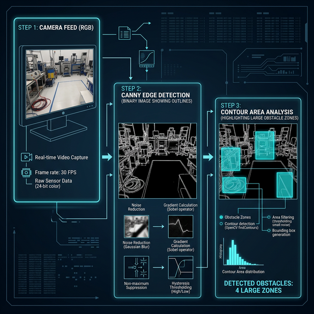

# 🧭 VisionAid: AI-Powered Autonomous Navigator



[](https://visionaid.streamlit.app/)
[](https://opensource.org/licenses/MIT)

**VisionAid** is a state-of-the-art navigation assistant designed to empower visually impaired individuals by converting real-time environmental data into intuitive spatial audio cues and haptic feedback. Built with a focus on **low-latency performance** and **accessibility**, VisionAid transforms any modern smartphone or laptop into a wearable autonomous navigator.

---

## ✨ Key Features

### 🚀 Real-Time Intelligence

- **YOLOv8n Object Detection**: High-speed detection of people, vehicles, stairs, and household obstacles.
- **Lightweight Obstacle Detection**: A unique proprietary contour-based detector (<5ms) that identifies unknown obstacles even when the primary AI is idle.
- **Spatial Auditory Cues**: Categorizes detects into **Left, Center,** and **Right** zones with relative distance estimation.

### 🔊 Multi-Language Accessibility
- **Trilingual Voice Support**: Full voice feedback in **English**, **Tamil (தமிழ்)**, and **Hindi (हिन्दी)**.
- **Dynamic Proximity Haptics**: Integrated Web Vibration API providing tactile distance alerts (requires a one-tap user interaction to enable).
- **High-Contrast UI**: A sleek, accessibility-first "Caregiver View" designed for high visibility and monitoring.

### ⚡ Performance Optimized

- **Minimal Latency Engine**: Optimized for CPU-only environments (like Streamlit Cloud) using frame-skipping logic and reduced inference resolution.
- **Memory Efficient**: Removed heavy dependencies (Torch/Timm) in favor of a lean, high-performance runtime.

---

## 🛠️ Technology Stack

- **Core Engine**: Python 3.10+
- **Vision**: OpenCV, Ultralytics YOLOv8n
- **UI Framework**: Streamlit
- **Communication**: Web Speech API (Voice), Web Vibration API (Haptics)
- **Streaming**: Streamlit-WebRTC

---

## 🚀 Getting Started

### 🌐 Cloud Access
The fastest way to experience VisionAid is via our livedeploy:
👉 **[Launch VisionAid on Streamlit Cloud](https://visionaid.streamlit.app/)**

### 💻 Local Installation

1.  **Clone the Repository**
    ```bash
    git clone https://github.com/Abinanthan-CG/visual-AID.git
    cd visual-AID
    ```

2.  **Install Dependencies**
    ```bash
    pip install -r requirements.txt
    ```

3.  **Run the Application**
    ```bash
    streamlit run app.py
    ```

---

## 🔧 Deployment Configuration

If deploying to **Streamlit Cloud** or a **Debian-based server**, ensure `packages.txt` is present to resolve headless OpenCV dependencies:

```text
libgl1
libglib2.0-bin
```

---

## 🗺️ Navigation Logic

VisionAid uses a priority-based announcement system:
*   **Urgent Warnings**: "Stop! Object Ahead" triggered for critical proximity.
*   **Spatial Context**: "Person on your left", "Car moving right".
*   **Safety Debounce**: Intelligent 800ms-1500ms debouncing to prevent audio fatigue while maintaining safety.
*   **Clear Path**: Frequent "Path appears clear" heartbeats to provide user confidence during movement.

---

## 🍓 Hardware Editions
The repository also includes `pi_navigator.py` and `pi_setup.sh`, a dedicated version optimized for **Raspberry Pi 5** hardware, leveraging OpenVINO for on-device edge acceleration.

---

## 🤝 Contributing
Contributions are welcome! If you have ideas for improving the distance estimation algorithms or adding new languages, please open an issue or submit a pull request.

## 📝 License
This project is licensed under the MIT License - see the [LICENSE](LICENSE) file for details.

---
*Empowering independence through vision-to-auditory transformation.*
